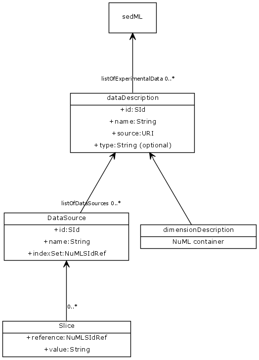

## Accessing Data SED-ML
We have been discussing for a long time how to provide access to (experimental) data sources in SED-ML, ultimately this culminated in the google document: 

<https://docs.google.com/document/d/1rrs0fYuKFr4fgL1b7eGwSnaLhRPW6NdXwAaJY0ZN_WY/>

left to do was to gather these thoughts and try them out in a prototype. Here I describe one such prototype and the specific extensions to SED-ML that would be needed to make it work. (And that hopefully could be released in an L1V3). 

### The data format
Here the decision was made by the community at HARMONY 2013, where it was decided that the data format for accessing data in SED-ML should be NuML. 

### UML diagram

  

 
### The Syntax

#### The extended `<sedML>` element
The top level `<sedML>` element is extended by a `<listOfDataSets>` that can contain one or more `<dataSet>` elements.

#### The `<dataSet>` element
The new class `<dataSet>` references a file containing data points, along with a description on how to access that file, and what information to extract from it. The `<dataSet>` class introduces four attributes `id`, `name`, `source`, and `type`. As well as the elements `<dimensionDescription>` and `<listOfDataSources>`. 

##### The `id` and `name` attributes
The attribute `id` of type SId is meant to uniquely identify the `<dataSet>` element, while the optional `name` attribute of type string, is there to provide a human readable representation if desired. 

##### The `source` attribute
Analog to how the `source` attribute on the `<model>` is handled, this attribute provides a location to a data file. The same sources as for the `<model>` element are to be allowed: be it a local file system, a relative link or an online resource.

##### The optional `type` attribute
Since we decided that the data format of all SED-ML descriptions ought to be NuML, we might not need this attribute anymore, so I left it optional for now. It would be an identifier for the data format, chosen from a controlled vocabulary, analog to how we list the supported model languages in `urn:sedml:language`.  

		<dataSet id="Data1" name="Oscli Time Course Data" 
	     source="http://svn.code.sf.net/p/libsedml/code/trunk/Samples/data/oscli.numl" 
	     type="urn:sedml:format:numl">
	     ...
		</dataSet>
  
##### The `<dimensionDescription>` element
The `<dimensionDescription>` element is just the data description from the NuML file. Consider for example: 

		<dimensionDescription>
			<compositeDescription indexType="double" id="time" name="time" 
	          xmlns="http://www.numl.org/numl/level1/version1">
			<compositeDescription indexType="string" id="SpeciesIds" name="SpeciesIds">
				<atomicDescription valueType="double" name="Concentration" />
			</compositeDescription>
			</compositeDescription>
		</dimensionDescription>

Here we have a nested NuML `<componentDescription>` with `time` spanning one dimension and `SpeciesIds` another. This two dimensional space is then filled with double values representing concentrations. 

##### The `<listOfDataSources>` element
The `<listOfDataSources>` contains one or more `<dataSource>` elements that are then used in the remainder of the SED-ML document. 

#### The `<dataSource>` element
The `<dataSource>` element now extracts junks out of the data file provided in the `<dataSet>` element. The element has the attributes: `id`, `name`, `indexSet` and a number of `<slice>` elements. 

##### The `id` and `name` attributes
The attribute `id` of type SId is meant to uniquely identify the data description element, while the optional `name` attribute of type string, is there to provide a human readable representation if desired. 

##### The `indexSet` attribute
Since data elements in NuML are either values, or indices, the `<dataSource>` element needs two ways of addressing those elements. The `indexSet` attribute allows to address all indices privided by NuML elements with `indexType`. So for example in for the `time` componentDescription above, a `dataSource`: 

			<dataSource id="dataTime" indexSet="time" />

would extract the set of all time points stored in the index. Similarly: 

			<dataSource id="allIds" indexSet="SpeciesIds" />

would extract all the species id strings stored in that index set. Valid values for `indexSet` are all NuML Id elements declared in the `<dimensionDescription>`. If the `indexSet` attribute is specified the corresponding `<dataSource>` may not define any `<slice>` elements.  

#### The `<slice>` elements
If a `<dataSource>` does not define the `indexSet` attribute, it will contain `<slice>` elements. Each slice removes one dimension from the data hypercube. For that the `<slice>` element defines two attributes: `reference` and `value`. 

##### The `reference` attribute
The `reference` attribute references one of the indices described in the `<dimensionDescription>`. In the example above, valid values would be: `time` and `SpeciesIds`. 
  
##### The `value` attribute
The `value` attribute now takes the value of a specific index in the referenced set of indices. For example: 

			<dataSource id="dataS1">
			  <slice reference="SpeciesIds" value="S1" />
			</dataSource>
  
would slice isolate the index set of all species ids specified, to only the single entry for `S1`, however over the full range of the `time` index set. As stated before, there could be multiple slice elements present, so it would be feasible to slice the data again, to obtain a single time point, for example the initial one: 

			<dataSource id="dataS1">
			  <slice reference="time" value="0" />
			  <slice reference="SpeciesIds" value="S1" />
			</dataSource>

#### Using the `dataSource`s
Once the `<dataSource>` elements are defined the idea is, that they can be reused anywhere in the SED-ML Description. In the current prototype I have implemented it such, that they can occur within the `<listOfVariables>` of `<dataGenerators>`, `<computeChange>` or `<setValue>`. Here an example that re-uses the above data source `dataS1`: 

    <dataGenerator id="dgDataS1" name="S1 (data)">
      <listOfVariables>
        <variable id="varS1" modelReference="model1" target="#dataS1" />
      </listOfVariables>
      <math xmlns="http://www.w3.org/1998/Math/MathML">
        <ci> varS1 </ci>
      </math>
    </dataGenerator>

This represents a change from L1V1 and L1V2, in which we would always have used a `taskReference` for a `<variable>` in a data generator. 

NOTE: to indicate that the `target` is an entity defined within the SED-ML description I here use a  hashtag (`#`) with the id.    

NOTE: In this example I choose to use the `modelReference` instead. This is mainly to facilitate a mapping of the data encode in the NuML document with a given model. One example for this would be for example when the `indexType` of a `<componentDescription>` would be an xpath expression. 
  
### Outlook
From this point on, we really need to prototype more, and try to exchange descriptions that use this approach. It might be better suitable to introduce additional convenience classes such as a `<dataRange>` that would derive from `<range>`, or a construct to more readily parameterize a Model with initial values from a `<dataSet>` (the one could just describe an index set to be used that contains the xpath expressions to the elements to be changed, together with a set of slices, to pick out a specific _row_ from the data file).  

### An Example
Here an example that demonstrates the use of the datasources in a basic description. Here a given model is simulated (using a uniform time course simulation), that simulation result is plotted in one plot, a second plot obtains a stored result (using the datasources), extract the 'S1' and 'time' column from it and renders it.

  

 
	<?xml version="1.0" encoding="utf-8"?>
	<!-- Written by libSedML v1.1.5198.25027 see http://libsedml.sf.net -->
	<sedML level="1" version="2" xmlns="http://sed-ml.org/sed-ml/level1/version2">

	<listOfDataSets>
		<dataSet id="Data1" name="Oscli Time Course Data" 
	     source="http://svn.code.sf.net/p/libsedml/code/trunk/Samples/data/oscli.numl" 
	     type="urn:sedml:format:numl">

		<dimensionDescription>
			<compositeDescription indexType="double" id="time" name="time" 
	          xmlns="http://www.numl.org/numl/level1/version1">
			<compositeDescription indexType="string" id="SpeciesIds" name="SpeciesIds">
				<atomicDescription valueType="double" name="Concentrations" />
			</compositeDescription>
			</compositeDescription>
		</dimensionDescription>

		<listOfDataSources>
			<dataSource id="dataS1">
			<slice reference="SpeciesIds" value="S1" />
			</dataSource>
			<dataSource id="dataTime" indexSet="time" />
		</listOfDataSources>
		</dataDescription>
	</listOfDataSets>

	<listOfSimulations>
		<uniformTimeCourse id="sim1" initialTime="0" 
	     outputStartTime="0" outputEndTime="10" numberOfPoints="100">
		  <algorithm kisaoID="KISAO:0000019">
			<listOfAlgorithmParameters>
			<algorithmParameter kisaoID="KISAO:0000209" value="1E-06" />
			<algorithmParameter kisaoID="KISAO:0000211" value="1E-12" />
			<algorithmParameter kisaoID="KISAO:0000415" value="10000" />
			</listOfAlgorithmParameters>
		  </algorithm>
		</uniformTimeCourse>
	</listOfSimulations>
	<listOfModels>
		<model id="model1" language="urn:sedml:language:sbml" 
         source="http://sourceforge.net/p/libsedml/code/119/tree/trunk/Samples/models/oscli.xml?format=raw" />
	</listOfModels>
	<listOfTasks>
		<task id="task1" modelReference="model1" simulationReference="sim1" />
	</listOfTasks>
	<listOfDataGenerators>
		<dataGenerator id="time_1" name="time">
		<listOfVariables>
			<variable id="time" name="time" taskReference="task1" symbol="urn:sedml:symbol:time" />
		</listOfVariables>
		<math xmlns="http://www.w3.org/1998/Math/MathML">
			<ci> time </ci>
		</math>
		</dataGenerator>
		<dataGenerator id="S1_1" name="S1">
		<listOfVariables>
			<variable id="S1" name="S1" taskReference="task1" 
             target="/sbml:sbml/sbml:model/sbml:listOfSpecies/sbml:species[@id='S1']" />
		</listOfVariables>
		<math xmlns="http://www.w3.org/1998/Math/MathML">
			<ci> S1 </ci>
		</math>
		</dataGenerator>
		<dataGenerator id="S2_1" name="S2">
		<listOfVariables>
			<variable id="S2" name="S2" taskReference="task1" 
             target="/sbml:sbml/sbml:model/sbml:listOfSpecies/sbml:species[@id='S2']" />
		</listOfVariables>
		<math xmlns="http://www.w3.org/1998/Math/MathML">
			<ci> S2 </ci>
		</math>
		</dataGenerator>
		<dataGenerator id="dgDataS1" name="S1 (data)">
		<listOfVariables>
			<variable id="varS1" modelReference="model1" target="#dataS1" />
		</listOfVariables>
		<math xmlns="http://www.w3.org/1998/Math/MathML">
			<ci> varS1 </ci>
		</math>
		</dataGenerator>
		<dataGenerator id="dgDataTime" name="Time">
		<listOfVariables>
			<variable id="varTime" modelReference="model1" target="#dataTime" />
		</listOfVariables>
		<math xmlns="http://www.w3.org/1998/Math/MathML">
			<ci> varTime </ci>
		</math>
		</dataGenerator>
	</listOfDataGenerators>
	<listOfOutputs>
		<plot2D id="plot1" name="Time Course (Oscli)">
		<listOfCurves>
			<curve id="curve1" logX="false" logY="false" xDataReference="time_1" yDataReference="S1_1" />
			<curve id="curve2" logX="false" logY="false" xDataReference="time_1" yDataReference="S2_1" />
		</listOfCurves>
		</plot2D>
		<plot2D id="plot2" name="Data (Oscli)">
		<listOfCurves>
			<curve id="curve3" logX="false" logY="false" xDataReference="dgDataTime" yDataReference="dgDataS1" />
		</listOfCurves>
		</plot2D>
	</listOfOutputs>
	</sedML>

---
4/17/2014 9:11:33 PM  Frank T. Bergmann
